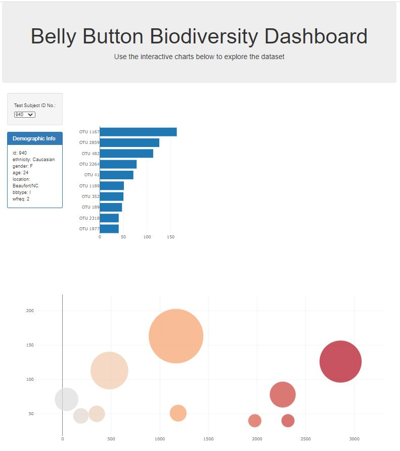
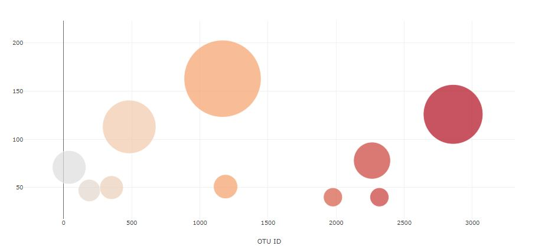

# Interactive Dashboard of Belly Button Biodiversity

## About The Project

### Background

* [Belly Button Biodiversity](http://robdunnlab.com/projects/belly-button-biodiversity/)

* Build an interactive dashboard to explore the Belly Button Biodiversity dataset, which catalogs the microbes that colonize human navels.

### Built With

* HTML/CSS
* Javascript
* JSON file

## Procedures

1. Use the D3 library to read in `samples.json`.

2. Create a horizontal bar chart with a dropdown menu to display the top 10 OTUs found in that individual.

* Use `sample_values` as the values for the bar chart.

* Use `otu_ids` as the labels for the bar chart.

* Use `otu_labels` as the hovertext for the chart.

  [bar Chart](Images/hw01.JPG)

3. Create a bubble chart that displays each sample.

* Use `otu_ids` for the x values.

* Use `sample_values` for the y values.

* Use `sample_values` for the marker size.

* Use `otu_ids` for the marker colors.

* Use `otu_labels` for the text values.

4. Display the sample metadata, i.e., an individual's demographic information.

5. Display each key-value pair from the metadata JSON object somewhere on the page.

[hw](Images/hw03.JPG)

6. Plot the weekly washing frequency of the individual.

[hw](Images/hw02.png)

6. Update all of the plots any time that a new sample is selected.

## Deployment

* Deploy this app to GitHub Pages
* You can check this app through [Interactive Dashboard of Belly Button Biodiversity](https://braden77.github.io/Plotly-Challenge/)

